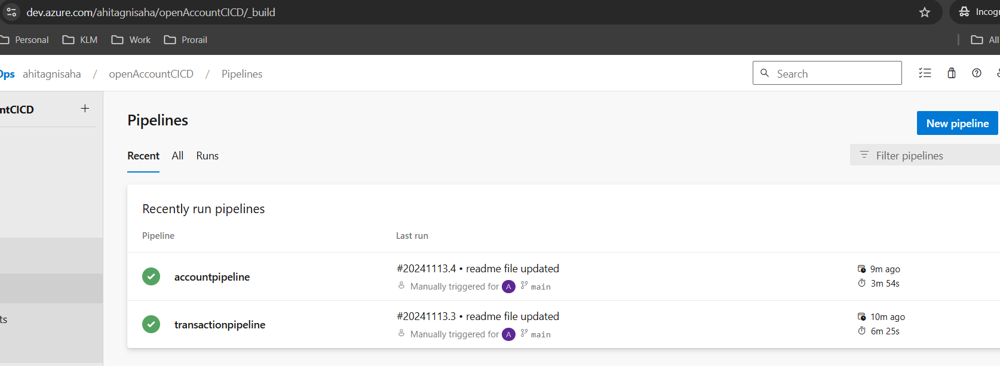

# Application on Open Current account for Existing customer

This application is about opening a new current account for already customers.

**Technologies used**
  * Java 17
  * Springboot 3
  * Maven 3
  * H2 inmemory databse
  * Azure devops
  * Kubernetes

There are two microservices **account** and **transaction**.

### API Details ### 
The apis in the **account** microservices are :

1. (`PostMapping`) http://localhost:8080/api/accounts/open?customerID=1&initialCredit=0
this api is used to open current account for existing customer. If initial credit is not zero then it will create a transaction and
will call transaction service. Below is the success response :

    {
        "accountId": 1,
        "customerId": 1,
        "status": "Account created successfully"
    }

If customer does not exist, then response will be like this :

    {
        "message": "Customer not found with customerId : 3"
    }

Validations are also added on parameter level in this api.
There is a IntialDataloader file there to upload 2 customer Id in `customer_detail` table.

2. (`GetMapping`) http://localhost:8080/api/accounts/userInfo?customerID=1
this api requires `customerid` as requestparam and response structure is given below:

       {
           "name": "Ahitagni",
           "surname": "Saha",
           "balance": 3,
           "accounts": [
               {
                   "accountId": 1,
                   "balance": 0,
                   "transactions": []
               },
               {
                   "accountId": 2,
                   "balance": 3,
                   "transactions": [
                        {
                           "trxId": 1,
                           "amount": 3
                        }
                   ]
               }
           ]
       }

The apis in the **transaction** microservices are :

1. (`PostMapping`) http://localhost:8082/api/transactions/create
this api will be called from **account** microservice, if `initialcredit` is not zero.
response structure is like this

    `Transaction is created for account Id 2`

2. (`GetMapping`) http://localhost:8082/api/transactions/account/1
this api will provide details of transaction details of accounts passing `accountId` as requestparam.
response structure is like below

       [
           {
               "trxId": 1,
               "amount": 4.0
           }
       ]

### Database tables ###
In **account** microservice there are `account` and `customer_detail` tables. 
`account` table is in manytoone relation with `customer_detail` like below.

      @ManyToOne
      @JoinColumn(name = "userId")
      private CustomerDetail customerDetail;

In **transaction** microservice, there is `transaction` table. It saves `accountId`, `transactionAmount` and `timestamp`.

You can access **account** database with this [Account H2 console path](http://localhost:8080/h2-console) with below details

      JDBC URL : jdbc:h2:mem:accountdb
      User name : sa
      Password : password

and **transaction** database with this [Transaction H2 console path](http://localhost:8082/h2-console) with below details

      JDBC URL : jdbc:h2:mem:transactiondb
      User Name : sa
      Password : password

### Swagger Configuration ###
Here are the swagger URL for both the microservices [account](http://localhost:8080/swagger-ui/index.html) and [transaction](http://localhost:8082/swagger-ui/index.html)

### Devops pipeline ###
There is [azure-pipelines-account.yml](https://github.com/Ahitagni07/openCurrentAccount/blob/main/azure-pipelines-account.yml) and 
[azure-pipelines-transaction.yml](https://github.com/Ahitagni07/openCurrentAccount/blob/main/azure-pipelines-transaction.yml), where azure pipelines
are defined to deploy both the microservices as container image and host the applications in kubernetes cluster. I have used Azure container registry to 
store the images for both the account and transaction services. And from ACR, images are pulled to Kubernetes cluster. I have used Load balancer service so 
external IP can be given for external access.

Here is the image of successful run azure pipeline.

For Kubernetes deployment `service` and `deployment` files are also present inside `manifest` folder.

### Testing ###
For testing purpose, I have created a [docker-compose.yml](https://github.com/Ahitagni07/openCurrentAccount/blob/main/docker-compose.yml) file,
through which two microservices can communicate with each other with service name.
Unit test cases are also written on `controller` and `service` classes.

For testing, you can run `docker-compose up -d` command inside the project directory, it will build and run both the images for
`account-service` and `transaction-service` using the respective Dockerfile in each service’s folder.

